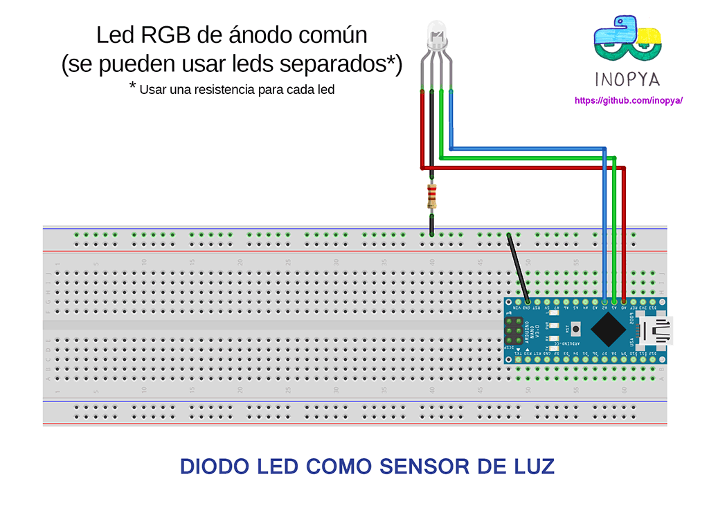

# Diodo led como sensor de luz
Uso de un diodo led como sensor de luz, aprovechando su capacidad interna al polarizarse en inversa

      ===== NOTAS DE LA VERSION ===== 
    Uso de un diodo led comun como sensor de luz:
    
    Un diodo led presenta una cierta capacitancia interna en la union PN.
    Al polarizarlo en inverso cargaremos dicho "condensador",
    y este se descargará más rapido cuanta mas luz reciba la union PN.
    Por tanto si tras polarizarlo en inverso medimos el tiempo que tarda en descargarse,
    podemos estimar la cantidad de luz que ha recibido.
    Un manera más sencilla sin tener que esperar a medir el tiempo de la descarga 
    de dicha capacitancia interna es el que empleamos aqui.
    
    1) Polarizamos en inverso,
    2) esperamos unos pocos milisegundos y medimos el valor de voltaje remanente.
    
    Si no hubiese indicido ninguna luz, tras unos pocos milisegundos la carga sería el voltaje al que fue sometido.
    
    En presencia de luz, cuanto menor sea el valor leido, mayor podemos asegurar que ha sido la cantidad de luz incidente
    
    Cada led 'medirá' luz en una longitud de onda próxima al tipo de luz que emite
    Los mejores resultados los obtendremos con leds rojos o verdes y cuerpo transparente.
    Pero podemos usar cualquier led del que disppongamos.

    El ANODO del led se conectará a tierra mediante una resistencia de entre 200 y 270 ohmios
    Dicha resitencia no es obligatoria dado que el diodo esta en inverso, pero quede ahí por si deseamos usar el led como
    emisor de luz y como sensor a un mismo tiempo conectando el ANODO a una salida digital.
    
    El CATODO se conecta a una entrada analogica de arduino.
    
    Podemos usar simultaneamente leds de distintos colores apra medir distintas longitudes de onda de la luz

    En el ejemplo se usa un led RGB de anodo comun para medir tres componentes de la luz a un mismo tiempo.

**Esquema conexion**

